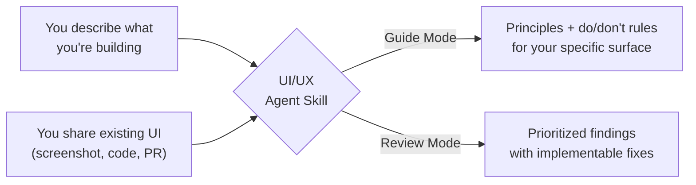
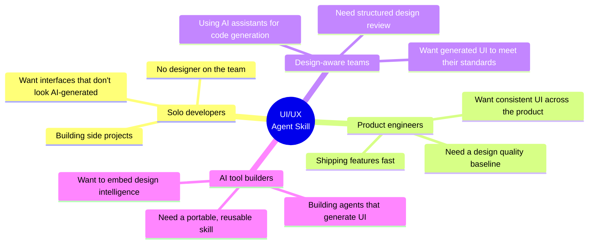
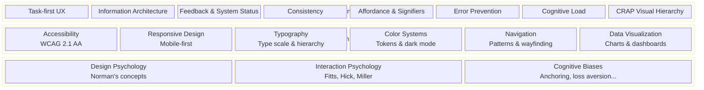
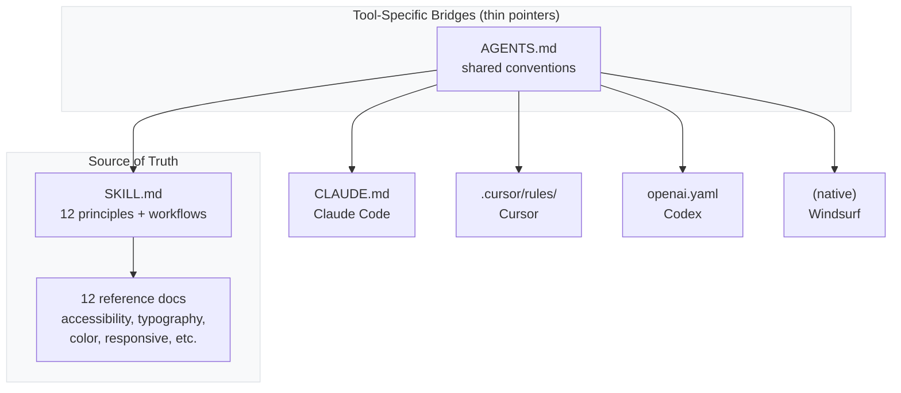

# UI/UX Agent Skill

**Give your AI coding assistant a design eye.**

A skill that teaches Codex, Claude Code, Cursor, and Windsurf how to think about UI/UX — so the interfaces they generate (or review) aren't just functional, but well-designed.

---

## The Problem

AI coding assistants are getting very good at writing code. They're not yet good at designing interfaces.

Ask an AI to "build a settings page" and you'll get something that works. It will have inputs, labels, a save button. But it probably won't have:

- A clear visual hierarchy (what should the user notice first?)
- Accessible color contrast (can everyone read this?)
- Proper error states (what happens when things go wrong?)
- Consistent spacing (why does this feel "off"?)
- Keyboard navigation (what about users who can't use a mouse?)

This skill fixes that. It gives your AI assistant a structured framework of design principles — grounded in cognitive psychology, accessibility standards, and real-world UI patterns — so it can generate better interfaces and catch problems in existing ones.

---

## What It Does

Two modes. One skill.



### Guide Mode

Tell it what you're building. Get back design principles tailored to your surface type — with specific, implementable rules.

**Example prompt:**
```
Use the ui-ux-agent-skill in guide mode.
I'm building a settings page for a SaaS dashboard.
Users need to manage notification preferences, API keys, and team roles.
```

**What you get back:**

> **Surface:** Settings / Preferences (web dashboard)
> **Primary task:** Configure account settings
> **Primary CTA:** Save changes
>
> **Applicable principles:**
>
> - **Task-first UX** — Group settings by user mental model (Account, Security, Notifications, Integrations), not by data type. The most-changed settings go first.
> - **Progressive complexity** — Show common settings by default. API keys and webhook config behind an "Advanced" or "Developer" section.
> - **Error prevention** — Inline validation on API key format. Confirm before revoking team member access. Show what will happen: "This will remove Alex's access to all projects."
> - **Help text layering** — L0: clear toggle labels. L1: one-line explanation under high-risk settings (e.g., "Disabling this will stop all email notifications"). L2: "Learn more" link for complex topics. No paragraphs of instructions.
> - **Accessibility** — All toggles need visible labels (not just on/off). Contrast ratio on muted helper text must meet 4.5:1. Tab order follows visual layout.

### Review Mode

Share a screenshot, mock, HTML, or PR. Get back a structured audit with prioritized fixes.

**Example prompt:**
```
Use the ui-ux-agent-skill in review mode.
Review this screenshot of our onboarding flow.
The primary user task is creating their first project.
```

**What you get back:**

> ### P0 — No feedback after "Create Project" button click
>
> **Diagnosis:** Feedback gap / Gulf of Evaluation
>
> **Evidence:** Clicking "Create Project" produces no visible response. Button doesn't change state, no loading indicator, no success message.
>
> **Impact:** All users. They don't know if the project was created. They'll click again (duplicate) or leave (abandoned).
>
> **Fix:**
> 1. Add loading state to button (disabled + spinner) on click
> 2. On success: redirect to the new project with a brief "Project created" confirmation
> 3. On failure: inline error below the form with retry guidance
>
> ---
>
> ### P1 — Form asks for 8 fields upfront
>
> **Diagnosis:** Cognitive overload
>
> **Evidence:** Project creation requires: name, description, team, visibility, template, color, icon, and tags — all on one screen.
>
> **Fix:** Only require name. Default everything else. Let users customize after creation. The fastest path to value is an empty project, not a perfectly configured one.

---

## Who Needs This



**In short:** anyone who uses an AI coding assistant to build interfaces and wants the output to be genuinely well-designed — not just functional.

---

## What It Covers

12 core principles and 12 reference documents, spanning everything from cognitive psychology to CSS spacing scales.



<details>
<summary><strong>Full coverage breakdown</strong></summary>

| Domain | What's in it | Reference file |
|---|---|---|
| **Core UX** | Task-first design, information architecture, feedback loops, consistency, affordance, error prevention, cognitive load, CRAP hierarchy | `SKILL.md` |
| **System Principles** | Concept constancy, copy discipline, state perceptibility, help text layering (L0-L3), progressive complexity, feedback loop closure | `system-principles.md` |
| **Accessibility** | WCAG 2.1 AA baseline, keyboard nav, screen readers, color contrast, forms, touch targets, media, testing checklist | `accessibility.md` |
| **Responsive Design** | Mobile-first, breakpoint strategy, fluid layouts, touch vs pointer, content adaptation, layout patterns | `responsive-design.md` |
| **Typography** | Type scale (Minor Third / Major Third / Perfect Fourth), font pairing, line height, measure (45-75ch), letter spacing, responsive type | `typography.md` |
| **Color Systems** | Palette structure, semantic tokens, WCAG contrast, dark mode, data viz color, psychology | `color-systems.md` |
| **Navigation** | Nav patterns (top/side/bottom/hamburger), breadcrumbs, tabs, wayfinding, search, mobile nav | `navigation.md` |
| **Data Visualization** | Data-ink ratio, chart type selection, dashboard design, axis/label rules, interaction, formatting | `data-visualization.md` |
| **Design Psychology** | Affordances, signifiers, mapping, constraints, conceptual models, feedback, gulfs of execution/evaluation, slips vs mistakes | `design-psych.md` |
| **Interaction Psychology** | Fitts's Law, Hick's Law, Miller's Law, anchoring, default effect, peak-end rule, loss aversion, inattentional blindness | `interaction-psychology.md` |
| **Icons** | No-emoji rule, one-family rule, when to use text instead, suggested sets (Lucide, Heroicons, Phosphor), common mappings | `icons.md` |
| **Motion** | Animation purpose, motion vocabulary, canvas stability, red flags, consistency rules | `SKILL.md` |

</details>

---

## Non-Negotiables

Five rules the skill enforces without exception:

| Rule | Why |
|---|---|
| **No emoji as icons** | Emoji renders inconsistently, lacks semantic precision, signals amateur design |
| **One icon family** | Mixed icon styles create visual noise and erode trust |
| **Minimize copy** | Text is the last resort. If layout and icons communicate it, words are redundant |
| **WCAG 2.1 AA minimum** | Accessibility is a quality standard, not a feature toggle |
| **No decoration without purpose** | Every gradient, shadow, and animation must answer: "what does this help the user understand?" |

---

## Installation

### One command, all agents

```bash
npx skills add narenkatakam/ui-ux-agent-skill -a codex -a claude-code -a cursor -a windsurf
```

Add `-g` for global (applies to all your projects):

```bash
npx skills add narenkatakam/ui-ux-agent-skill -g -a codex -a claude-code -a cursor -a windsurf
```

### Single agent

```bash
npx skills add narenkatakam/ui-ux-agent-skill -a claude-code    # Claude Code
npx skills add narenkatakam/ui-ux-agent-skill -a codex           # Codex
npx skills add narenkatakam/ui-ux-agent-skill -a cursor          # Cursor
npx skills add narenkatakam/ui-ux-agent-skill -a windsurf        # Windsurf
```

<details>
<summary><strong>Manual installation</strong></summary>

Copy files into your project or user-level config:

| Agent | What to copy | Where |
|---|---|---|
| **Codex** | `skills/ui-ux-agent-skill/` + `agents/openai.yaml` | `~/.codex/skills/` + project root |
| **Claude Code** | `CLAUDE.md` | Project root (it loads `AGENTS.md` and `SKILL.md`) |
| **Cursor** | `.cursor/rules/ui-ux-agent-skill.mdc` | Project root |
| **Windsurf** | `AGENTS.md` | Project root |

</details>

---

## How to Use

Once installed, just ask your AI assistant naturally. The skill activates based on context.

### Quick prompts

```
# Guide mode — building something new
"I'm building a dashboard for monitoring API usage. Apply the ui-ux-agent-skill."

# Review mode — auditing something existing
"Review this component for UX issues. Use the ui-ux-agent-skill in review mode."

# Specific domain
"Check the accessibility of this form component against the ui-ux-agent-skill."

# During code generation
"Generate a settings page. Follow the ui-ux-agent-skill principles."
```

### What to expect

| Mode | Input | Output |
|---|---|---|
| **Guide** | Description of what you're building | Tailored principles, do/don't rules, component recommendations, accessibility requirements |
| **Review** | Screenshot, HTML, PR, or component code | P0/P1/P2 prioritized findings, root-cause diagnosis, implementable fixes, verification checklist |

---

## Architecture

The skill uses a hub-and-spoke model — one source of truth, zero duplication across tools.



```
.
├── AGENTS.md                              # Shared conventions
├── CLAUDE.md                              # Claude Code bridge
├── .cursor/rules/ui-ux-agent-skill.mdc    # Cursor bridge
├── agents/openai.yaml                     # Codex bridge
└── skills/ui-ux-agent-skill/
    ├── SKILL.md                           # Core: 12 principles + 2 workflows
    └── references/                        # 12 deep-dive reference docs
        ├── accessibility.md
        ├── responsive-design.md
        ├── typography.md
        ├── color-systems.md
        ├── navigation.md
        ├── data-visualization.md
        ├── system-principles.md
        ├── interaction-psychology.md
        ├── design-psych.md
        ├── icons.md
        ├── checklists.md
        └── review-template.md
```

---

## Origin Story

This is a fork of [oil-oil/oiloil-ui-ux-guide](https://github.com/oil-oil/oiloil-ui-ux-guide) — a well-structured Chinese-language UI/UX skill by [oil-oil](https://github.com/oil-oil). The original had strong bones: solid core UX principles, a smart help-text layering system (L0-L3), Norman-inspired design psychology, and a clean multi-tool architecture.

What it was missing: accessibility, responsive design, typography, color systems, navigation patterns, data visualization — and English. This fork fills those gaps and adds a product-thinking perspective: every rule traces back to a user outcome, not a style preference.

**What changed:**

| | Original | This fork |
|---|---|---|
| Language | Chinese (docs + demos) | English |
| Core principles | 8 (A-H) | 12 (A-L) |
| Reference docs | 6 | 12 |
| Accessibility | Not covered | Full WCAG 2.1 AA guide |
| Responsive | Not covered | Mobile-first guide |
| Typography | Not covered | Type scale, pairing, hierarchy |
| Color | Not covered | Semantic tokens, dark mode, contrast |
| Navigation | Not covered | Patterns, wayfinding, mobile |
| Data viz | 4 bullets | Full chart selection + dashboard guide |
| Total content | ~800 lines | ~3,000 lines |

---

## License

[Apache License 2.0](./LICENSE.txt)

Built by [Naren Katakam](https://narenkatakam.com). Original work by [oil-oil](https://github.com/oil-oil).
