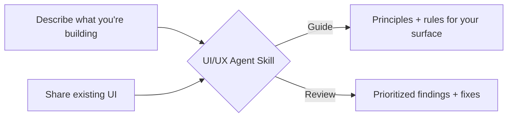

# UI/UX Agent Skill

**Give your AI coding assistant a design eye.**

A skill that teaches Codex, Claude Code, Cursor, and Windsurf how to think about UI/UX — so the interfaces they generate aren't just functional, but well-designed.

---

## What Is This?

AI coding assistants write good code. They don't design good interfaces. They'll miss visual hierarchy, accessible contrast, proper error states, consistent spacing, and keyboard navigation.

This skill gives them a structured framework — 12 design principles grounded in cognitive psychology, accessibility standards, and real-world UI patterns — delivered in two modes:



**Guide Mode** — you describe what you're building, you get back tailored principles with implementable do/don't rules.

```
"I'm building a settings page for a SaaS dashboard. Apply the ui-ux-agent-skill."
```

> Groups settings by mental model, layers help text, enforces accessible toggles, validates inline. [Full example](./docs/how-it-works.md#guide-mode)

**Review Mode** — you share a screenshot, HTML, or PR, you get back a structured audit.

```
"Review this onboarding flow. Use the ui-ux-agent-skill in review mode."
```

> P0: no feedback after button click. P1: 8-field form should be 1. Each with diagnosis, evidence, and fix. [Full example](./docs/how-it-works.md#review-mode)

---

## Install & Use

### One command, all agents

```bash
npx skills add narenkatakam/ui-ux-agent-skill -a codex -a claude-code -a cursor -a windsurf
```

Add `-g` for global (applies to all your projects):

```bash
npx skills add narenkatakam/ui-ux-agent-skill -g -a codex -a claude-code -a cursor -a windsurf
```

### Single agent

```bash
npx skills add narenkatakam/ui-ux-agent-skill -a claude-code    # Claude Code
npx skills add narenkatakam/ui-ux-agent-skill -a codex           # Codex
npx skills add narenkatakam/ui-ux-agent-skill -a cursor          # Cursor
npx skills add narenkatakam/ui-ux-agent-skill -a windsurf        # Windsurf
```

### Usage

Once installed, just ask naturally. The skill activates based on context.

```
"I'm building a dashboard for monitoring API usage. Apply the ui-ux-agent-skill."
"Review this component for UX issues. Use the ui-ux-agent-skill in review mode."
"Check the accessibility of this form against the ui-ux-agent-skill."
"Generate a settings page. Follow the ui-ux-agent-skill principles."
```

[Manual installation](./docs/architecture.md#manual-installation) | [Full prompt examples](./docs/how-it-works.md)

---

## What Changes

| Without the skill | With the skill |
|---|---|
| Generic layouts, no hierarchy | Task-first UX with clear primary actions |
| No accessibility consideration | WCAG 2.1 AA enforced as baseline |
| Vague "looks off" feedback | P0/P1/P2 findings with root-cause diagnosis |
| Emoji as icons, decoration-first | One icon family, every element earns its place |
| No error states or feedback | Loading, success, failure, and empty states covered |

Covers 12 domains — from cognitive psychology to CSS spacing scales. [Full coverage breakdown](./docs/coverage.md)

---

## License

[Apache License 2.0](./LICENSE.txt) — Built by [Naren Katakam](https://narenkatakam.com). Original work by [oil-oil](https://github.com/oil-oil). [Origin story](./docs/origin-story.md)
