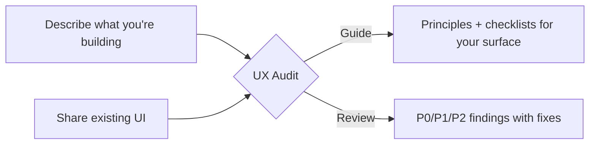

<p align="center">
  
</p>

<p align="center">
  <a href="https://github.com/narenkatakam/ux-audit/releases"></a>
  <a href="./LICENSE.txt"></a>
  <a href="https://github.com/narenkatakam/ux-audit/stargazers"></a>
  
</p>

# UX Audit

**Give your AI coding assistant a design eye.**

A skill that teaches Claude Code, Cursor, Codex, and Windsurf how to think about UI/UX — so the interfaces they generate aren't just functional, but well-designed.

12 design principles. 13 reference docs. 7 component checklists. Two modes: **guide** (build it right) and **review** (audit what exists).

---

## Before / After

Without the skill, AI assistants generate functional but flat UI. With it, they produce interfaces with hierarchy, feedback, accessibility, and intent.

**A delete confirmation — without the skill:**

```html
<dialog>
  <p>Are you sure you want to delete?</p>
  <button>Yes</button>
  <button>No</button>
</dialog>
```

No specifics. No consequence framing. "Yes/No" labels. User can't tell what they're losing.

**With the skill:**

```html
<dialog role="dialog" aria-modal="true" aria-labelledby="delete-title"
  class="max-w-md rounded-xl p-6 shadow-lg">
  <h2 id="delete-title" class="text-lg font-semibold">Delete "Q4 Report"?</h2>
  <p class="text-sm text-gray-600 mt-2">
    This will permanently delete the report and 12 comments. This can't be undone.
  </p>
  <div class="flex justify-end gap-3 mt-6">
    <button class="px-4 py-2 rounded-lg border text-gray-700
      hover:bg-gray-50 focus:ring-2 focus:ring-offset-2">Cancel</button>
    <button class="px-4 py-2 rounded-lg bg-red-600 text-white
      hover:bg-red-700 focus:ring-2 focus:ring-red-500 focus:ring-offset-2">
      Delete report</button>
  </div>
</dialog>
```

Names what's being deleted. States the consequence. Action-specific button labels. Accessible markup. Focus styles. Destructive action visually distinct.

**A loading state — without the skill:**

```jsx
{loading ? <Spinner /> : <Content />}
```

Spinner replaces all content. Layout jumps when data arrives.

**With the skill:**

```jsx
<div class="space-y-3">
  <div class="h-6 w-48 bg-gray-200 rounded animate-pulse" />
  <div class="h-4 w-full bg-gray-200 rounded animate-pulse" />
  <div class="h-4 w-3/4 bg-gray-200 rounded animate-pulse" />
</div>
```

Skeleton preserves layout. No content shift. User sees the page is loading, not broken.

---

## Two Modes



### Guide Mode

Tell it what you're building. Get back tailored principles with do/don't code examples.

```
"I'm building a settings page for a SaaS dashboard. Apply the ux-audit skill."
```

You get: settings grouped by mental model, help text layered by severity, accessible toggles with visible labels, inline validation, and a component checklist for the surface. [Full example →](./docs/how-it-works.md#guide-mode)

### Review Mode

Share a screenshot, mock, HTML, or PR. Get back a structured audit.

```
"Review this onboarding flow. Use the ux-audit skill in review mode."
```

You get: prioritized findings (P0/P1/P2), root-cause diagnosis (gulf of execution, cognitive overload, accessibility failure), implementable fixes, and a verification checklist. [Full example →](./docs/how-it-works.md#review-mode)

### How long does a review take?

| Surface | Typical time |
|---|---|
| Single component (button, card, modal) | 1-2 minutes |
| Full page (settings, form, dashboard) | 3-5 minutes |
| Multi-page flow (onboarding, checkout) | 5-10 minutes |

Time depends on complexity and the number of findings. Guide mode is faster; review mode is more thorough.

---

## Install

### Quick install (recommended)

Interactive installer — detects your agent and sets everything up:

```bash
curl -sSL https://raw.githubusercontent.com/narenkatakam/ux-audit/main/install.sh | bash
```

Or clone and run directly:

```bash
git clone https://github.com/narenkatakam/ux-audit.git
cd ux-audit && ./install.sh
```

### Per-agent install

<details>
<summary><strong>Claude Code</strong></summary>

```bash
# Global (all projects)
mkdir -p ~/.claude/skills/ux-audit
cp -r skills/ux-audit/* ~/.claude/skills/ux-audit/

# Project-level
mkdir -p .claude/skills/ux-audit
cp -r skills/ux-audit/* .claude/skills/ux-audit/
```

Then add to your `CLAUDE.md`:

```
Load skills from ~/.claude/skills/ux-audit/SKILL.md
```

</details>

<details>
<summary><strong>Cursor</strong></summary>

```bash
mkdir -p .cursor/rules
cp .cursor/rules/ux-audit.mdc .cursor/rules/
cp -r skills/ AGENTS.md .
```

The rule file loads automatically when Cursor reads your project.

</details>

<details>
<summary><strong>Codex</strong></summary>

```bash
cp agents/openai.yaml .
cp -r skills/ .
```

Codex picks up the skill from the YAML config.

</details>

<details>
<summary><strong>Windsurf</strong></summary>

```bash
cp AGENTS.md .
cp -r skills/ .
```

Windsurf reads `AGENTS.md` as its instruction file.

</details>

### Try without installing

Paste these 5 rules into your AI assistant's system prompt to test the difference:

```
1. No emoji as UI icons — use a proper icon set.
2. One primary CTA per screen, identifiable in 3 seconds.
3. Cover all states: loading, empty, error, success.
4. WCAG 2.1 AA contrast minimum on all text.
5. Spacing: 4px base unit, tight within groups, loose between.
```

If that changes how your AI builds UI, install the full skill.

---

## Usage

Once installed, just ask naturally:

```
"I'm building a dashboard for monitoring API usage. Apply the ux-audit skill."
"Review this component for UX issues. Use the ux-audit skill in review mode."
"Check the accessibility of this form against the ux-audit skill."
"Generate a settings page. Follow the ux-audit principles."
"I'm building a modal for user deletion. Apply the ux-audit skill."
```

---

## What's Inside

**[Explore the interactive coverage map →](https://narenkatakam.github.io/ux-audit/skill-coverage-map.html)**

### 12 core principles (SKILL.md)

| | Principle | One-liner |
|---|---|---|
| A | Task-First UX | One primary CTA per screen, identifiable in 3 seconds |
| B | Information Architecture | Group by mental model, not database structure |
| C | Feedback & System Status | Every action answers: did it work? what changed? what's next? |
| D | Consistency | Same interaction = same component + wording + placement |
| E | Affordance + Signifiers | Clickable things look clickable, constraints shown before submit |
| F | Error Prevention | Prevent first, confirm destructive, give actionable recovery |
| G | Cognitive Load | Sensible defaults, progressive disclosure, carry context forward |
| H | CRAP Visual Hierarchy | Contrast, repetition, alignment, proximity — in that order |
| I | Accessibility | WCAG 2.1 AA floor, keyboard nav, screen reader support |
| J | Responsive Design | Mobile-first, 44px touch targets, content hierarchy preserved |
| K | Typography | Type scale, 2 fonts max, 45-75ch line length |
| L | Color Systems | Semantic tokens, one accent, test for contrast |

### 13 reference docs (references/)

Deep-dive guidance on: system principles, psychology, accessibility, responsive design, typography, color systems, navigation, data visualization, icons, forms, UI states, overlays, and review templates.

### 7 component checklists (checklists/)

"Building a [X]? Check these before shipping." — 12-14 items each for: buttons, cards, tables, forms, modals, navigation, dashboards.

### 5 non-negotiables

| Rule | Why |
|---|---|
| No emoji as icons | Inconsistent rendering, no semantics, signals amateur design |
| One icon family | Mixed styles create visual noise |
| Minimize copy | If layout and icons communicate it, words are redundant |
| WCAG 2.1 AA minimum | Accessibility is a quality standard, not a feature |
| No decoration without purpose | Every effect must answer: "what does this help the user understand?" |

[Full coverage breakdown →](./docs/coverage.md) | [Architecture →](./docs/architecture.md)

---

## What's New (v2)

The original release had solid principles but left developers to interpret paragraphs. v2 closes the gap between "good advice" and "code I can ship."

- **Every principle now has do/don't code examples** — Tailwind + React snippets you can copy-paste, not paragraphs to interpret. (Phase 1)
- **3 new reference docs: forms, UI states, overlays** — the most common "what do I do here?" moments now have deep-dive guidance with decision trees. (Phase 2)
- **7 component checklists** — building a table? A modal? A dashboard? Start with a 12-14 item checklist that references the right principles and docs. No more guessing which rules apply to your surface. (Phase 3)
- **Quick-reference index** — "I need help with [X] → read [Y]" lookup table at the top of SKILL.md. Find the right doc in seconds. (Phase 3)
- **Review template tightened** — verification split into Essential (15 must-pass) and Polish (20 items). 6 example findings across forms, dashboards, and settings — so AI assistants know exactly what good audit output looks like. (Phase 3)
- **Core principles sharpened** — "modern minimal" vibes replaced with concrete rules: max shadow blur values, max colors per component, whitespace ratios, border-radius scales. (Phase 1)
- **Dark mode deepened** — elevation strategy, saturation reduction, separate contrast audit. (Phase 1)

The net effect: AI assistants using this skill now produce more specific, more consistent, and more shippable UI — especially for the surfaces developers build most (forms, tables, dashboards, settings).

---

## Origin

Forked from [oil-oil/oiloil-ui-ux-guide](https://github.com/oil-oil/oiloil-ui-ux-guide) — a well-structured Chinese-language UI/UX skill with strong bones: solid core principles, a smart help-text layering system (L0-L3), Norman-inspired psychology, and clean multi-tool architecture.

This fork rewrote it in English and filled the gaps: accessibility, responsive design, typography, color systems, navigation, data visualization, forms, UI states, overlays, component checklists, and structured review workflows. Every rule traces back to a user outcome, not a style preference. [Full origin story →](./docs/origin-story.md)

---

## License

[Apache License 2.0](./LICENSE.txt) — Built by [Naren Katakam](https://narenkatakam.com). Original work by [oil-oil](https://github.com/oil-oil).
