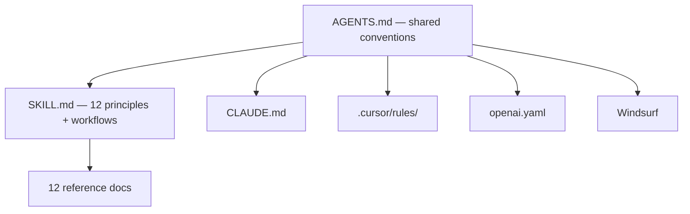

# Architecture

Hub-and-spoke model — one source of truth, zero duplication across tools.



---

## File Tree

```
.
├── AGENTS.md                              # Shared conventions
├── CLAUDE.md                              # Claude Code bridge
├── .cursor/rules/ui-ux-agent-skill.mdc    # Cursor bridge
├── agents/openai.yaml                     # Codex bridge
├── docs/                                  # Detailed documentation
│   ├── README.md
│   ├── how-it-works.md
│   ├── coverage.md
│   ├── architecture.md
│   └── origin-story.md
└── skills/ui-ux-agent-skill/
    ├── SKILL.md                           # Core: 12 principles + 2 workflows
    └── references/                        # 12 deep-dive reference docs
        ├── accessibility.md
        ├── responsive-design.md
        ├── typography.md
        ├── color-systems.md
        ├── navigation.md
        ├── data-visualization.md
        ├── system-principles.md
        ├── interaction-psychology.md
        ├── design-psych.md
        ├── icons.md
        ├── checklists.md
        └── review-template.md
```

---

## Manual Installation

Copy files into your project or user-level config:

| Agent | What to copy | Where |
|---|---|---|
| **Codex** | `skills/ui-ux-agent-skill/` + `agents/openai.yaml` | `~/.codex/skills/` + project root |
| **Claude Code** | `CLAUDE.md` | Project root (it loads `AGENTS.md` and `SKILL.md`) |
| **Cursor** | `.cursor/rules/ui-ux-agent-skill.mdc` | Project root |
| **Windsurf** | `AGENTS.md` | Project root |
