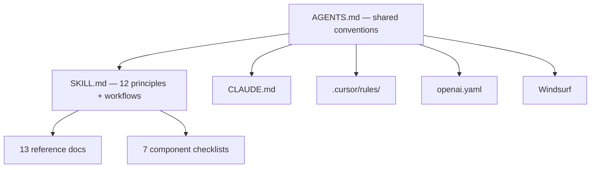

# Architecture

Hub-and-spoke model — one source of truth, zero duplication across tools.



---

## File Tree

```
.
├── AGENTS.md                              # Shared conventions
├── CLAUDE.md                              # Claude Code bridge
├── .cursor/rules/ux-audit.mdc            # Cursor bridge
├── agents/openai.yaml                     # Codex bridge
├── docs/                                  # Detailed documentation
│   ├── README.md
│   ├── how-it-works.md
│   ├── coverage.md
│   ├── architecture.md
│   └── origin-story.md
├── install.sh                             # Interactive multi-agent installer
└── skills/ux-audit/
    ├── SKILL.md                           # Core: 12 principles + 2 workflows
    ├── checklists/                        # 7 component checklists
    │   ├── buttons.md
    │   ├── cards.md
    │   ├── tables.md
    │   ├── forms.md
    │   ├── modals.md
    │   ├── navigation.md
    │   └── dashboards.md
    └── references/                        # 13 deep-dive reference docs
        ├── accessibility.md
        ├── color-systems.md
        ├── data-visualization.md
        ├── forms.md
        ├── icons.md
        ├── navigation.md
        ├── overlays.md
        ├── psychology.md
        ├── responsive-design.md
        ├── review-template.md
        ├── system-principles.md
        ├── typography.md
        └── ui-states.md
```

---

## Manual Installation

Copy files into your project or user-level config:

| Agent | What to copy | Where |
|---|---|---|
| **Claude Code** | `skills/ux-audit/` | `~/.claude/skills/ux-audit/` (global) or `.claude/skills/ux-audit/` (project) |
| **Cursor** | `.cursor/rules/ux-audit.mdc` + `skills/` + `AGENTS.md` | Project root |
| **Codex** | `skills/ux-audit/` + `agents/openai.yaml` | Project root |
| **Windsurf** | `skills/` + `AGENTS.md` | Project root |
