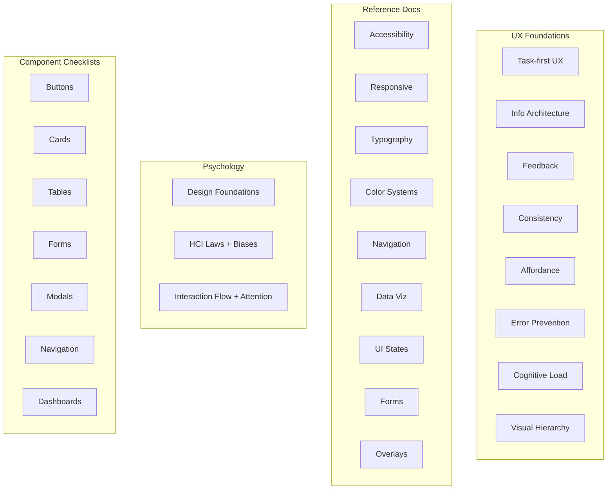

# Coverage

12 core principles, 13 reference documents, and 7 component checklists — spanning cognitive psychology to CSS spacing scales.

---

## Full Breakdown

| Domain | What's in it | File |
|---|---|---|
| **Core UX** | Task-first design, information architecture, feedback loops, consistency, affordance, error prevention, cognitive load, CRAP hierarchy | `SKILL.md` |
| **System Principles** | Concept constancy, copy discipline, state perceptibility, help text layering (L0-L3), progressive complexity, feedback loop closure | `references/system-principles.md` |
| **Accessibility** | WCAG 2.1 AA baseline, keyboard nav, screen readers, color contrast, forms, touch targets, media, testing checklist | `references/accessibility.md` |
| **Responsive Design** | Mobile-first, breakpoint strategy, fluid layouts, touch vs pointer, content adaptation, layout patterns | `references/responsive-design.md` |
| **Typography** | Type scale (Minor Third / Major Third / Perfect Fourth), font pairing, line height, measure (45-75ch), letter spacing, responsive type | `references/typography.md` |
| **Color Systems** | Palette structure, semantic tokens, WCAG contrast, dark mode, data viz color, psychology | `references/color-systems.md` |
| **Navigation** | Nav patterns (top/side/bottom/hamburger), breadcrumbs, tabs, wayfinding, search, mobile nav | `references/navigation.md` |
| **Data Visualization** | Data-ink ratio, chart type selection, dashboard design, axis/label rules, interaction, formatting | `references/data-visualization.md` |
| **Psychology** | Affordances, signifiers, mapping, constraints, conceptual models, feedback, gulfs, slips vs mistakes, Fitts's/Hick's/Miller's Law, cognitive biases, interaction flow, attention economy | `references/psychology.md` |
| **Icons** | No-emoji rule, one-family rule, when to use text instead, suggested sets (Lucide, Heroicons, Phosphor), common mappings | `references/icons.md` |
| **UI States** | Empty, loading, error, success state patterns, skeleton vs spinner decision tree, error copy patterns, confirmation flows | `references/ui-states.md` |
| **Forms** | Validation timing, inline errors, multi-step patterns, field grouping, auto-save, form-specific a11y | `references/forms.md` |
| **Overlays** | Modal/drawer/popover/bottom sheet sizing, focus traps, z-index scale, "which overlay?" decision tree | `references/overlays.md` |
| **Motion** | Animation purpose, motion vocabulary, canvas stability, red flags, consistency rules | `SKILL.md` |
| **Review Template** | P0/P1/P2 severity, diagnosis labels, finding format, Essential vs Polish verification, surface-specific gates | `references/review-template.md` |

---

## Component Checklists

"Building a [X]? Check these before shipping." — 12-14 items each, referencing principles and reference docs.

| Checklist | Items | Key coverage |
|---|---|---|
| **Buttons** | 12 | CTA hierarchy, states, loading, touch targets, disabled context, semantic HTML |
| **Cards** | 12 | Spacing, hover affordance, image handling, truncation, responsive grid, empty state |
| **Tables** | 13 | Column alignment, sort, fixed headers, pagination, search/filter, responsive strategy |
| **Forms** | 14 | Labels, validation timing, error messages, defaults, multi-step, autofill |
| **Modals** | 13 | Overlay type selection, focus trap, escape, scroll, no nesting, mobile bottom sheet |
| **Navigation** | 12 | Active state, 7±2 items, mobile pattern, breadcrumbs, skip link, touch targets |
| **Dashboards** | 13 | Lead metric, time range, chart rules, empty state, filters, export, a11y data tables |

---

## Non-Negotiables

Five rules the skill enforces without exception:

| Rule | Why |
|---|---|
| **No emoji as icons** | Emoji renders inconsistently, lacks semantic precision, signals amateur design |
| **One icon family** | Mixed icon styles create visual noise and erode trust |
| **Minimize copy** | Text is the last resort. If layout and icons communicate it, words are redundant |
| **WCAG 2.1 AA minimum** | Accessibility is a quality standard, not a feature toggle |
| **No decoration without purpose** | Every gradient, shadow, and animation must answer: "what does this help the user understand?" |

---

## Who Needs This

- **Solo developers** — building side projects without a designer, want interfaces that don't look AI-generated
- **Product engineers** — shipping fast, need a design quality baseline and consistent UI
- **Design-aware teams** — using AI for code gen, want output to meet their standards
- **AI tool builders** — building agents that generate UI, want to embed portable design intelligence
