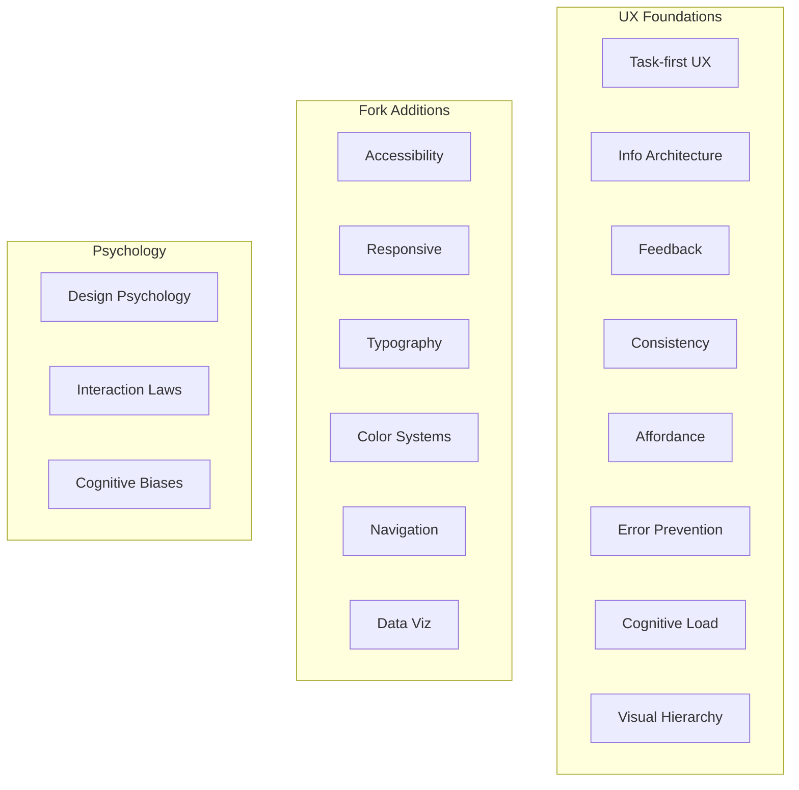

# Coverage

12 core principles and 12 reference documents, spanning cognitive psychology to CSS spacing scales.

---

## Full Breakdown

| Domain | What's in it | Reference file |
|---|---|---|
| **Core UX** | Task-first design, information architecture, feedback loops, consistency, affordance, error prevention, cognitive load, CRAP hierarchy | `SKILL.md` |
| **System Principles** | Concept constancy, copy discipline, state perceptibility, help text layering (L0-L3), progressive complexity, feedback loop closure | `system-principles.md` |
| **Accessibility** | WCAG 2.1 AA baseline, keyboard nav, screen readers, color contrast, forms, touch targets, media, testing checklist | `accessibility.md` |
| **Responsive Design** | Mobile-first, breakpoint strategy, fluid layouts, touch vs pointer, content adaptation, layout patterns | `responsive-design.md` |
| **Typography** | Type scale (Minor Third / Major Third / Perfect Fourth), font pairing, line height, measure (45-75ch), letter spacing, responsive type | `typography.md` |
| **Color Systems** | Palette structure, semantic tokens, WCAG contrast, dark mode, data viz color, psychology | `color-systems.md` |
| **Navigation** | Nav patterns (top/side/bottom/hamburger), breadcrumbs, tabs, wayfinding, search, mobile nav | `navigation.md` |
| **Data Visualization** | Data-ink ratio, chart type selection, dashboard design, axis/label rules, interaction, formatting | `data-visualization.md` |
| **Design Psychology** | Affordances, signifiers, mapping, constraints, conceptual models, feedback, gulfs of execution/evaluation, slips vs mistakes | `design-psych.md` |
| **Interaction Psychology** | Fitts's Law, Hick's Law, Miller's Law, anchoring, default effect, peak-end rule, loss aversion, inattentional blindness | `interaction-psychology.md` |
| **Icons** | No-emoji rule, one-family rule, when to use text instead, suggested sets (Lucide, Heroicons, Phosphor), common mappings | `icons.md` |
| **Motion** | Animation purpose, motion vocabulary, canvas stability, red flags, consistency rules | `SKILL.md` |

---

## Non-Negotiables

Five rules the skill enforces without exception:

| Rule | Why |
|---|---|
| **No emoji as icons** | Emoji renders inconsistently, lacks semantic precision, signals amateur design |
| **One icon family** | Mixed icon styles create visual noise and erode trust |
| **Minimize copy** | Text is the last resort. If layout and icons communicate it, words are redundant |
| **WCAG 2.1 AA minimum** | Accessibility is a quality standard, not a feature toggle |
| **No decoration without purpose** | Every gradient, shadow, and animation must answer: "what does this help the user understand?" |

---

## Who Needs This

- **Solo developers** — building side projects without a designer, want interfaces that don't look AI-generated
- **Product engineers** — shipping fast, need a design quality baseline and consistent UI
- **Design-aware teams** — using AI for code gen, want output to meet their standards
- **AI tool builders** — building agents that generate UI, want to embed portable design intelligence
